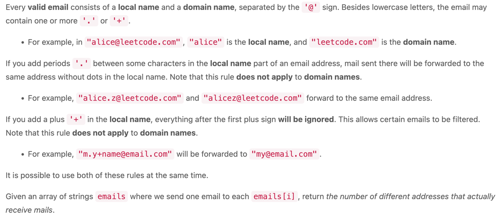
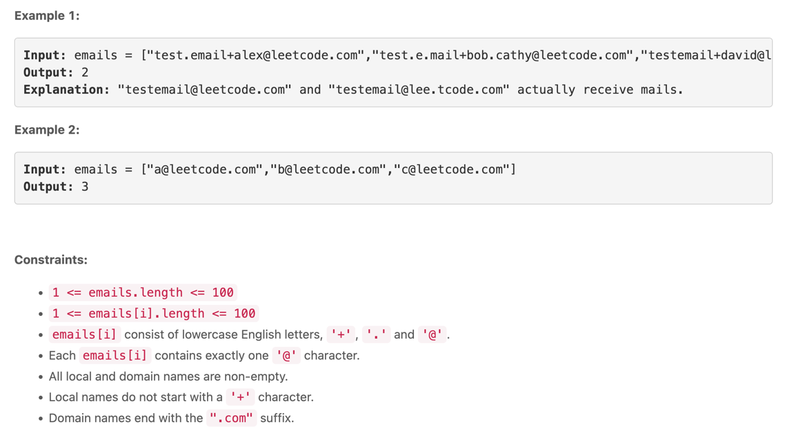

---
```java

public int numUniqueEmails(String[] emails) {
        Set<String> normalized = new HashSet<>(); // used to save simplified email address, cost O(n) sapce.
        for (String email : emails) {
            String[] parts = email.split("@"); // split into local and domain parts.
            String[] local = parts[0].split("\\+"); // split local by '+'.
            normalized.add(local[0].replace(".", "") + "@" + parts[1]); // remove all '.', and concatenate '@' and domain.        
        }
        return normalized.size();
    }
```
---
Analysis
Let n be the total characters in the input array emails. The HashSet normalized and the for loop both cost O(n), in terms of space and time, respectively.

Time & space: O(n).

---
Q & A

Q1: What is Java metacharacter?
A1: A metacharacter — a character with special meaning interpreted by the Java regular expression engine / matcher.
https://en.wikipedia.org/wiki/Metacharacter
https://docs.oracle.com/javase/tutorial/essential/regex/literals.html.

Q2: Why does Java regular expression use \\, instead of \, to escape metacharacter such as +, ., *, etc?

A2: I guess the reason is that the backslash character is an escape character in Java String literals already.

Update:

Credit to @helengu1996 for her link:

"There are two "escapings" going on here. The first backslash is to escape the second backslash for the Java language, to create an actual backslash character. The backslash character is what escapes the + or the s for interpretation by the regular expression engine. That's why you need two backslashes -- one for Java, one for the regular expression engine. With only one backslash, Java reports \s and + as illegal escape characters -- not for regular expressions, but for an actual character in the Java language."

